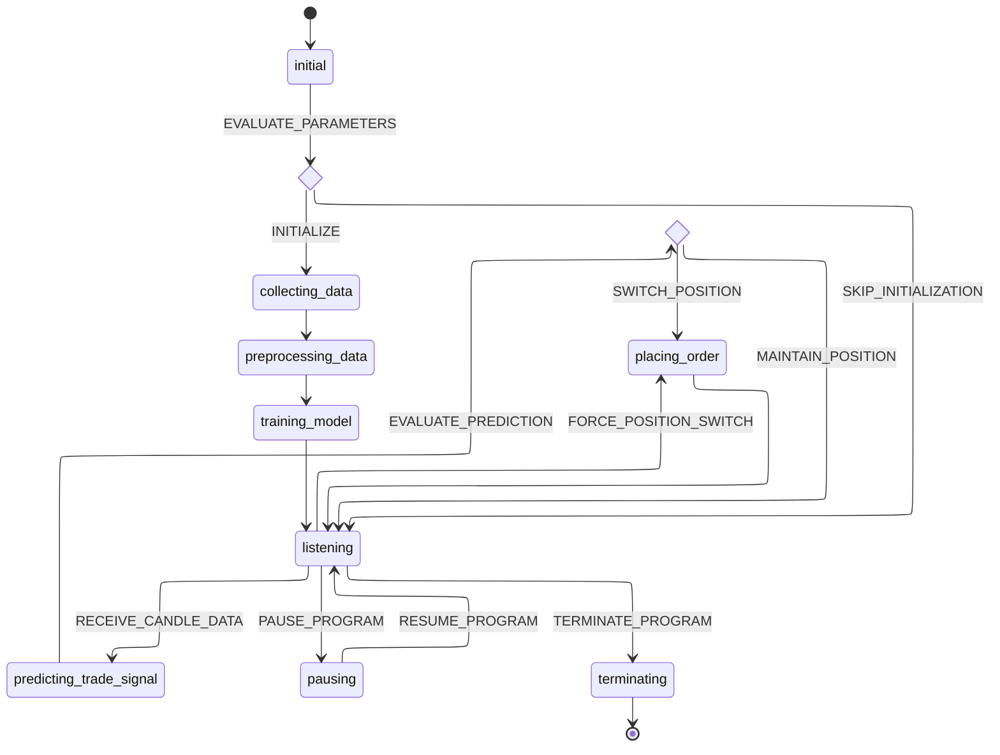

# FART

**FART** is a cryptocurrency trade platform that uses machine learning to make real-time trading decisions. It stands for **F**inancial **A**nalysis & **R**eal-time **T**rading. The trade platform is trained on historical data to generate buy/sell signals, which it then uses to execute trades in real-time.

## Motivation

The motivation for this project is twofold:
1. To deepen understanding of machine learning techniques in financial analysis.
2. To develop a potentially revenue-generating trade platform for cryptocurrency markets.

## Name

The name **FART** is an abbreviation play on the title "Financial Analysis and Real-time Trading". It is also the name of a gaseous being who appeared in the episode [Mortynight Run](https://www.imdb.com/title/tt4832254/) of the Rick and Morty series. There is a bit of musical part in the episode, which I really enjoyed. The name **FART** is a homage to that episode.

## Installation

Use the following command to install the project:

```bash
pdm install
```

## Usage

Use the following command to run the project:

```bash
make run # to run the trade platform
```

The run command will start the initialization of the trade platform. The trade platform operates based on the following principles:

- It runs in a loop specified by the interval passed as an argument (default is 30m).
- Each iteration, it checks the latest candle data.
- Using this data, it makes a prediction and places an order accordingly.
- It then waits for the next interval to repeat the process.

Key controls:

- <kbd>Escape</kbd>: Terminate the trade platform
- <kbd>Space</kbd>: Pause/Resume the trade platform
- <kbd>Tab</kbd> or <kbd>Enter</kbd>: Forcibly place an order to switch current position


Additional commands:

```bash
make data # to make the dataset
make train # to train the model
```

These commands are used internally by the run command and are not necessary to be executed separately. They are listed for reference purposes.

## State Machine Diagram

In order to get a better understanding of how the trade platform runs, a state machine diagram is provided. The state machine diagram shows the different states the trade platform can be in and the transitions between these states:



## Project Structure

The project is based on the [cookiecutter data science project template](https://drivendata.github.io/cookiecutter-data-science/).

```
    ├── LICENSE
    ├── Makefile           <- Makefile with commands like `make data` or `make train`.
    ├── README.md          <- The top-level README for developers using this project.
    │
    ├── data               <- Data from third party sources.
    │
    ├── docs               <- A default Sphinx project; see sphinx-doc.org for details.
    │
    ├── models             <- Trained and serialized models, model predictions, or model summaries.
    │
    ├── notebooks          <- Jupyter notebooks. Naming convention is a number (for ordering), the creator's initials, and a short `-` delimited description, e.g. `1.0-jqp-initial-data-exploration`.
    │
    ├── references         <- Data dictionaries, manuals, and all other explanatory materials.
    │
    ├── reports            <- Generated analysis as HTML, PDF, LaTeX, etc.
    │   └── figures        <- Generated graphics and figures to be used in reporting.
    │
    ├── tests              <- Unit tests of various modules and functions.
    │
    ├── pyproject.toml     <- The project file for reproducing the analysis environment, e.g. generated with `pdm init`.
    │                         
    └── src/fart           <- Source code for use in this project.
        ├── __init__.py    <- Makes src a Python module.
        │
        ├── data           <- Scripts to download or generate data.
        │   └── make_dataset.py
        │
        ├── features       <- Scripts to turn raw data into features for modeling.
        │   └── build_features.py
        │
        ├── models         <- Scripts to train models and then use trained models to make predictions.
        │   ├── predict_model.py
        │   └── train_model.py
        │
        └── visualization  <- Scripts to create exploratory and results oriented visualizations.
            └── visualize.py
```

## License

This project is licensed under the MIT License - see the [LICENSE](LICENSE) file for details.

## Acknowledgements

- [Rick and Morty](https://www.imdb.com/title/tt2861424/)
- [Cookiecutter Data Science](https://drivendata.github.io/cookiecutter-data-science/)
- [Mermaid](https://mermaid-js.github.io/mermaid/#/)
