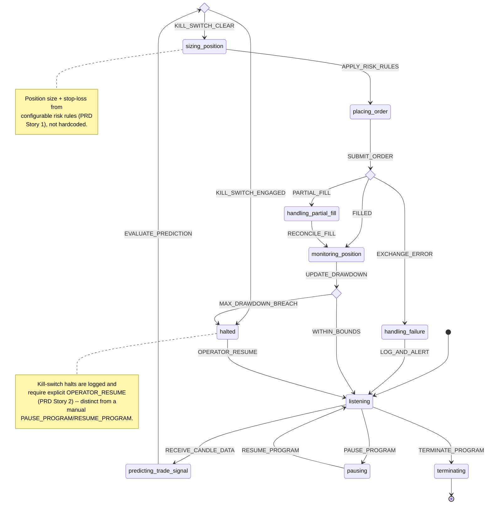

# F.A.R.T.

**F.A.R.T.** is a cryptocurrency trade platform that uses machine learning to make real-time trading decisions. It stands for **F**inancial **A**nalysis & **R**eal-time **T**rading. The trade platform is trained on historical data to generate buy/sell signals, which it then uses to execute trades in real-time.

## Motivation

The motivation for this project is twofold:
1. To deepen understanding of machine learning techniques in financial analysis.
2. To develop a potentially revenue-generating trade platform for cryptocurrency markets.

## Name

The name **F.A.R.T.** is an abbreviation play on the title "Financial Analysis and Real-time Trading". It is also the name of a gaseous being who appeared in the episode [Mortynight Run](https://www.imdb.com/title/tt4832254/) of the Rick and Morty series. There is a bit of musical part in the episode, which I really enjoyed. The name **F.A.R.T.** is a homage to that episode.

## Project Status

This is a solo research project, and it's mid-refactor — the code you'll find here is split across two planned initiatives, sequenced deliberately:

- **Part A — Signal generation.** Rewriting the model that turns historical candle data into buy/sell signals from a six-way classifier (up/down/hold) to a sequence-aware regression model, so it captures trade *magnitude* against cost rather than a bare direction. This is the active work: an [N-BEATS](#references) network trained on sliding windows of percent returns, predicting a per-candle magnitude and confidence. The initial version's confidence output turned out to be uncalibrated — the model was shrinking its predicted uncertainty to nearly the same value for every candle regardless of how right or wrong it actually was — so the loss was switched from plain Gaussian negative log-likelihood to [beta-NLL](#references), which reweights each window's loss contribution by its own predicted variance. That materially improved how well confidence tracks actual error, though it isn't fully calibrated yet.
  See the [Problem Framing Canvas](docs/product/part-a-signal-generation-refactor.md) and [PRD](docs/product/part-a-signal-generation-refactor-prd.md).
- **Part B — Trade execution.** Not yet started. Deliberately sequenced *after* Part A, and framed as a risk-management problem first (position sizing, stop-loss, kill switch, failure recovery) and a Bitvavo-connector problem second. The typed exchange wrapper (`fart/core/exchange.py`) and live terminal dashboard (`fart/core/dashboard.py`) exist as early scaffolding but aren't wired into a working entrypoint yet — `fart/core/broker.py` and `fart/model/predict_model.py`, which would tie them together, are still empty stubs.
  See the [Problem Framing Canvas](docs/product/part-b-trade-execution-system.md) and [PRD](docs/product/part-b-trade-execution-system-prd.md).

What actually works today, end to end, is downloading candle data and training the N-BEATS model on it (see Usage below) — everything downstream of a trained model (predictions, order placement, the live dashboard) is upcoming Part B work, not yet runnable.

## Installation

Use the following command to install the project:

```bash
uv sync
```

## Usage

Two commands work end to end today: downloading candle data and training the signal-generation model on it.

```bash
uv run fart download assets BTC-EUR 1h  # data_dir, market, interval
uv run fart train assets BTC-EUR 1h --months 3
```

`download` backfills OHLCV candle data from Bitvavo into a per-market/interval CSV cache under `data_dir`, resuming from the last cached candle on each run instead of re-fetching from scratch. It requires `BITVAVO_API_KEY` / `BITVAVO_API_SECRET` in a `.env` file.

`train` loads that cached data, computes technical indicators, and fits the N-BEATS model (see [Project Status](#project-status)) on sliding windows of percent returns, logging per-candle magnitude/confidence and saving a versioned checkpoint to `artifacts/`. `--months` limits training to the most recent N months of history (the full cached history is used if omitted).

Run `uv run fart --help` for the full set of options.

Everything past a trained checkpoint — turning predictions into orders, the live terminal dashboard, pause/resume/kill controls — is Part B and not implemented yet.

## Planned Trade Execution Flow

The state machine below is the target design for Part B's live-trading loop, not current behavior — it's included here to document the intended shape of the system once `fart/core/broker.py` is built out. It assumes a trained Part A checkpoint is already loaded (training is a separate, offline `fart train` run, not part of this loop) and follows the [PRD](docs/product/part-b-trade-execution-system-prd.md)'s risk-management-first framing: every signal passes through a kill-switch check and position sizing/stop-loss before an order is ever placed, and exchange-side failures (downtime, partial fills, rate limits, auth expiry) are handled explicitly rather than silently:


```mermaid

stateDiagram
   state kill_switch_condition <<choice>>
   state order_outcome_condition <<choice>>
   state drawdown_condition <<choice>>

   [*] --> listening

   listening --> predicting_trade_signal: RECEIVE_CANDLE_DATA
   listening --> pausing: PAUSE_PROGRAM
   listening --> terminating: TERMINATE_PROGRAM
   pausing --> listening: RESUME_PROGRAM
   terminating --> [*]

   predicting_trade_signal --> kill_switch_condition: EVALUATE_PREDICTION
   kill_switch_condition --> sizing_position: KILL_SWITCH_CLEAR
   kill_switch_condition --> halted: KILL_SWITCH_ENGAGED

   sizing_position --> placing_order: APPLY_RISK_RULES
   placing_order --> order_outcome_condition: SUBMIT_ORDER
   order_outcome_condition --> monitoring_position: FILLED
   order_outcome_condition --> handling_partial_fill: PARTIAL_FILL
   order_outcome_condition --> handling_failure: EXCHANGE_ERROR
   handling_partial_fill --> monitoring_position: RECONCILE_FILL
   handling_failure --> listening: LOG_AND_ALERT

   monitoring_position --> drawdown_condition: UPDATE_DRAWDOWN
   drawdown_condition --> listening: WITHIN_BOUNDS
   drawdown_condition --> halted: MAX_DRAWDOWN_BREACH

   halted --> listening: OPERATOR_RESUME

   note right of sizing_position
     Position size + stop-loss from
     configurable risk rules (PRD
     Story 1), not hardcoded.
   end note
   note right of halted
     Kill-switch halts are logged and
     require explicit OPERATOR_RESUME
     (PRD Story 2) -- distinct from a
     manual PAUSE_PROGRAM/RESUME_PROGRAM.
   end note
```

Two pieces of this are still open questions in the PRD, not finalized: the concrete max-drawdown threshold that trips `kill_switch_condition`, and the position-sizing model itself (fixed %, Kelly criterion, volatility-based). A dry-run/paper-trading mode that exercises this same flow without submitting real orders is also required before going live, but isn't drawn as separate states here to keep the diagram from doubling in size.

## Project Structure

The project follows the [cookiecutter data science project template](https://drivendata.github.io/cookiecutter-data-science/) layout, adapted to how this project actually works:

```
    ├── LICENSE
    ├── Makefile           <- Convenience wrappers around `uv run ...` commands.
    ├── README.md          <- The top-level README for developers using this project.
    │
    ├── assets             <- Cached candle data, one CSV per market/interval.
    │
    ├── artifacts          <- Versioned, trained model checkpoints.
    │
    ├── docs
    │   ├── product        <- Problem Framing Canvas + PRD for Part A and Part B.
    │   ├── specs          <- Design docs for individual pieces of work.
    │   └── plans          <- Implementation plans.
    │
    ├── notebooks          <- Jupyter notebooks. Naming convention is a number (for ordering), the creator's initials, and a short `-` delimited description, e.g. `1.0-kve-exploratory-data-analysis`.
    │
    ├── tests              <- Unit tests, mirroring the src/fart layout.
    │
    ├── pyproject.toml     <- Project + dependency config (managed with `uv`).
    │
    └── src/fart           <- Source code for use in this project.
        ├── cli.py         <- Typer entrypoint (the `fart` console script).
        ├── constants.py   <- Shared column names, UI labels, color palette.
        ├── downloader.py  <- Backfills candle data from Bitvavo.
        ├── utils.py       <- Path helpers (project root, candle/model file paths).
        │
        ├── core           <- Part B trade-execution scaffolding (not yet wired in).
        │   ├── broker.py      <- Empty stub; will tie exchange + dashboard together.
        │   ├── dashboard.py   <- Rich-based live terminal dashboard.
        │   └── exchange.py    <- Typed wrapper around the Bitvavo REST/websocket client.
        │
        ├── features       <- Feature engineering over Polars DataFrames.
        │   ├── calculate_technical_indicators.py
        │   ├── calculate_magnitude.py
        │   └── calculate_trade_returns.py
        │
        ├── model          <- Part A's regression pipeline.
        │   ├── train_model.py        <- Loads candles, computes indicators, fits N-BEATS.
        │   ├── nbeats.py             <- Hand-rolled, doubly-residual N-BEATS net.
        │   ├── nbeats_loss.py        <- Beta-NLL loss (see References).
        │   ├── nbeats_config.py      <- Model + training hyperparameters.
        │   ├── nbeats_persistence.py <- Checkpoint save/load.
        │   └── predict_model.py      <- Empty stub; not yet connected to a signal path.
        │
        └── visualization  <- Matplotlib/seaborn plotting helpers for notebooks.
```

## References

### Part A — Signal generation

Papers behind the current N-BEATS + beta-NLL signal-generation model (see [Project Status](#project-status)):

- Oreshkin, B. N., Carpov, D., Chapados, N., & Bengio, Y. (2020). [N-BEATS: Neural basis expansion analysis for interpretable time series forecasting](https://arxiv.org/abs/1905.10437). *ICLR 2020.* The doubly-residual, stacked backcast/forecast architecture `fart/model/nbeats.py` is built on. Note the original paper is a point-forecast architecture (trained with MAPE/SMAPE/MASE losses on the M4 competition) — it doesn't cover uncertainty estimation; the probabilistic `(mu, log_sigma)` head and its loss are this project's own addition on top of the backbone.
- Seitzer, M., Tavakoli, A., Antic, D., & Martius, G. (2022). [On the Pitfalls of Heteroscedastic Uncertainty Estimation with Probabilistic Neural Networks](https://arxiv.org/abs/2203.09168). *ICLR 2022.* Source of the beta-NLL loss (`fart/model/nbeats_loss.py`), used to fix a variance-collapse failure where plain Gaussian NLL let the model shrink predicted confidence to nearly the same value for every candle instead of learning which ones were actually harder to predict.

### Part B — Trade execution

Sources behind the risk-control design in the [Planned Trade Execution Flow](#planned-trade-execution-flow) (`kill_switch_condition`, `drawdown_condition`, position sizing, stop-loss). Unlike Part A, this is a mix of regulation and academic finance, not a single research lineage — and two pieces of the design (fixed-% position sizing, and the paper-trading/failure-handling operational practice) remain unsourced practitioner convention rather than citable work, which the [PRD](docs/product/part-b-trade-execution-system-prd.md) flags as its weakest section:

- U.S. Securities and Exchange Commission (2010). [Risk Management Controls for Brokers or Dealers with Market Access](https://www.sec.gov/files/rules/final/2010/34-63241-secg.htm), Rule 15c3-5. The regulatory origin of "kill switch" as a formal requirement — automated controls able to immediately halt an algorithm's order flow.
- Grossman, S. J., & Zhou, Z. (1993). [Optimal Investment Strategies for Controlling Drawdowns](https://onlinelibrary.wiley.com/doi/abs/10.1111/j.1467-9965.1993.tb00044.x). *Mathematical Finance*, 3, 241–276. Foundational work on constraining a strategy to never lose more than a fixed fraction of its peak value — the basis for `drawdown_condition`.
- Kelly, J. L. (1956). [A New Interpretation of Information Rate](https://onlinelibrary.wiley.com/doi/abs/10.1002/j.1538-7305.1956.tb03809.x). *Bell System Technical Journal*, 35, 917–926. One of the PRD's three named position-sizing model options.
- Moskowitz, T. J., Ooi, Y. H., & Pedersen, L. H. (2012). [Time Series Momentum](https://www.sciencedirect.com/science/article/pii/S0304405X11002613). *Journal of Financial Economics*. Scales each position to a target ex-ante volatility — the PRD's "volatility-based" sizing option.
- Kaminski, K. M., & Lo, A. W. (2014). [When Do Stop-Loss Rules Stop Losses?](https://www.sciencedirect.com/science/article/abs/pii/S138641811300030X) *Journal of Financial Markets*, 18, 234–254. Analytical framework for when a stop-loss rule helps vs. hurts expected returns.

## License

This project is licensed under the MIT License - see the [LICENSE](LICENSE) file for details.

## Acknowledgements

- [Rick and Morty](https://www.imdb.com/title/tt2861424/)
- [Cookiecutter Data Science](https://drivendata.github.io/cookiecutter-data-science/)
- [Mermaid](https://mermaid-js.github.io/mermaid/#/)
