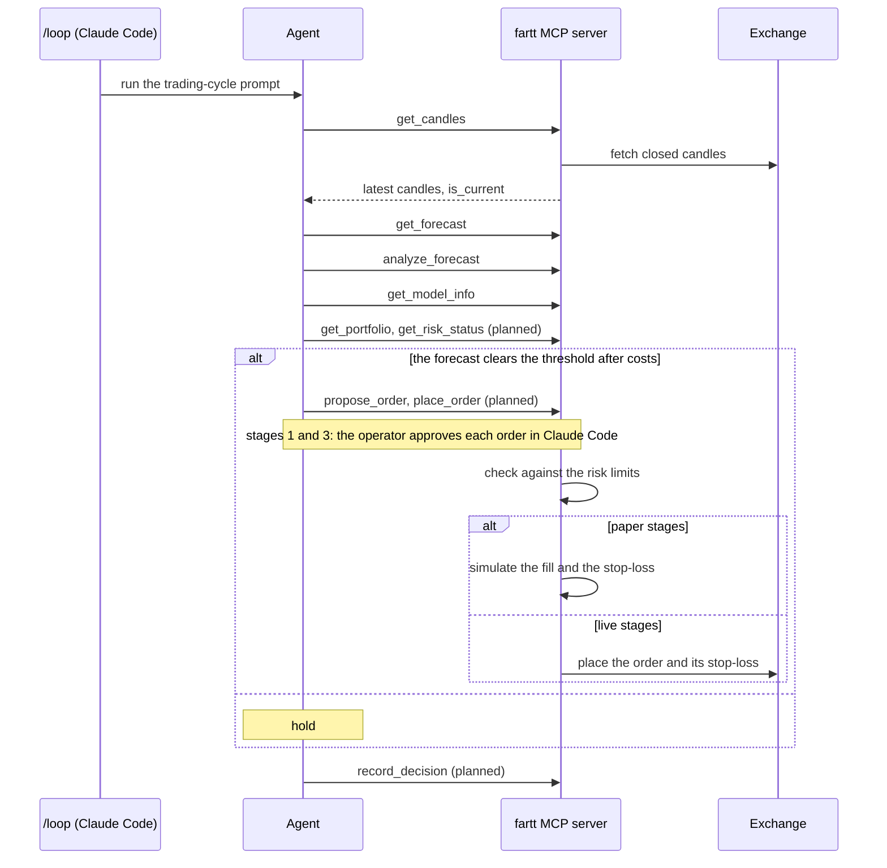

# Fartt

**Fartt** is an [MCP](https://modelcontextprotocol.io) server that gives an AI agent the tools to trade BTC: market data today, and forecasts from a trained model, portfolio state, server-enforced risk controls and orders as the work progresses. [Claude Code](https://claude.com/claude-code) is the agent and the operator's interface. It stands for **F**inancial **A**nalysis **R**eal **T**ime **T**rading.

## Motivation

The motivation for this project is twofold:
1. To deepen understanding of machine learning techniques in financial analysis.
2. To develop a potentially revenue-generating trade platform for cryptocurrency markets.

## Name

The name **Fartt** is an abbreviation play on the title "Financial Analysis Real Time Trading". It is also a nod to Fart, the gaseous being who appeared in the episode [Mortynight Run](https://www.imdb.com/title/tt4832254/) of the Rick and Morty series. There is a bit of musical part in the episode, which I really enjoyed. The name **Fartt** is a homage to that episode.

## Project Status

This is a solo research project. It started as a self-built trading platform (a signal model with its own order handling, monitoring and scheduling around it) and has been reshaped into an MCP server operated by an agent: the server owns everything that touches data, the model or money, and Claude Code runs the trading cycle and serves as the operator's interface. The reasoning, the tool surface, the model selection plan and the staged path from paper trading to a small live experiment are in the [PRD](docs/product/mcp-trading-agent-prd.md).

The work is delivered in epics, in this order:

1. **[Server Foundation](https://github.com/vanesterik/fartt/issues/44)**, done: the exchange layer (ccxt, Bitvavo by default), the candle cache, and the MCP server with `get_candles`.
2. **[Forecast Tools](https://github.com/vanesterik/fartt/issues/45)**: `get_forecast`, `analyze_forecast` and `get_model_info`, first backed by a naive baseline.
3. **[Paper Trading & Risk](https://github.com/vanesterik/fartt/issues/46)**: the portfolio, server-enforced risk limits, simulated orders and stop-losses, a kill switch and a decision journal, with orders approved by hand.
4. **[Model Selection](https://github.com/vanesterik/fartt/issues/47)**: screening the MLP, CNN, GRU, N-BEATS and a time-series transformer, plus foundation models, against naive baselines, then a walk-forward backtest after costs.
5. **[Unattended Operation](https://github.com/vanesterik/fartt/issues/48)**: paper trading without approvals.
6. **[Live Trading](https://github.com/vanesterik/fartt/issues/49)**: a small live experiment, first with approvals.

What works today: `fartt download` fills a local candle cache, and the candidate models are trained and evaluated in the notebooks. A Claude Code session in this directory can fetch the latest candles through `get_candles`, a forecast of the next candle's return through `get_forecast`, that forecast after trading costs through `analyze_forecast`, and what's behind it through `get_model_info`.

## Installation

The project's commands run through [Task](https://taskfile.dev) and [uv](https://docs.astral.sh/uv/), on Python 3.14 (pinned in `.python-version`; uv installs it if needed). With both installed (for example `mise use -g aqua:go-task/task`), install the project and its git hooks with:

```bash
task setup
```

`task --list` shows the other commands, such as `task check` to run every check the git hooks run.

## Usage

Two commands work today: `fartt download` fills a local candle cache, and `fartt serve` runs the MCP server that Claude Code starts.

```bash
uv run fartt download --assets-dir assets --market BTC/EUR --interval 1h
```

`download` backfills closed OHLCV candles from Bitvavo (through [ccxt](https://github.com/ccxt/ccxt), so other exchanges are an `--exchange` option away) into a per-market/interval CSV cache under `assets_dir`, resuming from the last cached candle on each run instead of re-fetching from scratch. Markets use ccxt's format (`BTC/EUR`); the cache files keep the dash form (`BTC-EUR-1h.csv`). Candles are public, so no API keys are needed.

The MCP server exposes the cache to Claude Code. It's registered in `.mcp.json`, so a Claude Code session in this directory starts it (`uv run fartt serve`), and the agent can call `get_candles` for the latest closed candles. Run `fartt download` with the same market and interval first, so the first call doesn't have to fill years of history:

```bash
uv run fartt download --market BTC/EUR --interval 1h
```

`fartt serve` also takes the analysis settings: `--fee`, `--slippage`, `--threshold` and `--hit-rate-window`, all fractions except the window (see `uv run fartt serve --help`).

There is no `train` command. Training and evaluation run from the notebooks, one per candidate architecture: `notebooks/2.0-kve-data-analysis-mlp.ipynb` (MLP) and `notebooks/2.1-kve-data-analysis-cnn.ipynb` (CNN). Each loads the cached data, computes the target (the candle return: the signed percent change as a fraction), builds sliding lag windows with a chronological 60/20/20 train/val/test split, fits its model (see [Project Status](#project-status)), and reports directional accuracy, RMSE and MAE. Neither saves a checkpoint yet.

Run `uv run fartt --help` for the full set of options. What comes next is in the [PRD](docs/product/mcp-trading-agent-prd.md) and the epics above.

## How a trading cycle works

Once the later epics land, a `/loop` in a Claude Code session runs one cycle per candle interval. The agent fetches the latest candles, gets a forecast and its analysis after costs, checks the portfolio and the risk limits, then holds or proposes an order, and records its decision with its reasoning either way. The server enforces the risk limits, not the agent: it rejects any order that breaks them, and the agent can read the limits but not change them. Today `get_candles`, `get_forecast`, `analyze_forecast` and `get_model_info` exist; the other tools are planned (see [PRD](docs/product/mcp-trading-agent-prd.md) §5 and §6).


```mermaid
sequenceDiagram
    participant Cycle as /loop (Claude Code)
    participant Agent
    participant Server as fartt MCP server
    participant Exchange

    Cycle->>Agent: run the trading-cycle prompt
    Agent->>Server: get_candles
    Server->>Exchange: fetch closed candles
    Server-->>Agent: latest candles, is_current
    Agent->>Server: get_forecast
    Agent->>Server: analyze_forecast
    Agent->>Server: get_model_info
    Agent->>Server: get_portfolio, get_risk_status (planned)
    alt the forecast clears the threshold after costs
        Agent->>Server: propose_order, place_order (planned)
        Note over Agent,Server: stages 1 and 3: the operator approves each order in Claude Code
        Server->>Server: check against the risk limits
        alt paper stages
            Server->>Server: simulate the fill and the stop-loss
        else live stages
            Server->>Exchange: place the order and its stop-loss
        end
    else
        Note over Agent: hold
    end
    Agent->>Server: record_decision (planned)
```

## Project Structure

The project follows the [cookiecutter data science project template](https://drivendata.github.io/cookiecutter-data-science/) layout, adapted to how this project actually works:

```
    ├── LICENSE
    ├── README.md          <- The top-level README for developers using this project.
    │
    ├── assets             <- Cached candle data, one CSV per market/interval.
    │
    ├── artifacts          <- Versioned, trained model checkpoints.
    │
    ├── docs
    │   ├── product        <- The PRD for the MCP trading agent.
    │   ├── specs          <- Design docs for individual pieces of work.
    │   └── plans          <- Implementation plans.
    │
    ├── notebooks          <- Jupyter notebooks. Naming convention is a number (for ordering), the creator's initials, and a short `-` delimited description, e.g. `1.0-kve-exploratory-data-analysis`.
    │
    ├── tests              <- Unit tests, mirroring the src/fartt layout.
    │
    ├── pyproject.toml     <- Project + dependency config (managed with `uv`).
    ├── .python-version    <- The pinned Python version (3.14).
    ├── Taskfile.yml       <- Everyday commands (`task --list`).
    ├── .mcp.json          <- Registers the MCP server for Claude Code.
    │
    └── src/fartt           <- Source code for use in this project.
        ├── candle_cache.py <- Append-only CSV candle cache, kept up to date through the exchange layer.
        ├── cli.py         <- argparse entrypoint (the `fartt` console script).
        ├── constants.py   <- Shared column names, indicator labels, colour palette.
        ├── utils.py       <- Path helpers (project root, candle/model file paths).
        │
        ├── exchange       <- Market data, behind an interface so the exchange stays swappable.
        │   ├── exchange.py        <- The Exchange Protocol and ExchangeUnavailable.
        │   ├── ccxt_exchange.py   <- Its ccxt implementation (Bitvavo by default).
        │   └── candle.py          <- The Candle type.
        │
        ├── forecast       <- The Forecaster interface, the naive baseline and the analysis.
        │   ├── forecaster.py      <- Forecaster Protocol, Forecast, forecast().
        │   ├── baseline.py        <- RepeatLastReturn.
        │   └── analysis.py        <- Settings, Analysis, analyze().
        │
        ├── server         <- The MCP server.
        │   └── server.py      <- build_server() and the four tools.
        │
        ├── features       <- Feature engineering over Polars DataFrames.
        │   ├── calculate_technical_indicators.py
        │   ├── calculate_candle_returns.py
        │   └── calculate_trade_returns.py
        │
        ├── model          <- Regression pipeline epic B (Model Selection) builds on.
        │   ├── prepare_datasets.py   <- Loads candles, computes candle returns, builds lag windows + split.
        │   ├── builder.py            <- ModelBuilder Protocol every architecture's builder satisfies.
        │   ├── blocks.py             <- Reusable linear/conv blocks.
        │   ├── mlp_config.py         <- MLP hyperparameters.
        │   ├── mlp_builder.py        <- Assembles the MLP from its config.
        │   ├── cnn_config.py         <- CNN hyperparameters.
        │   ├── cnn_builder.py        <- Assembles the CNN from its config.
        │   ├── train_model.py        <- Fits an already-built model; records per-epoch loss history.
        │   ├── evaluate_model.py     <- Directional accuracy, RMSE and MAE on train/test.
        │   └── persist_model.py      <- Checkpoint save/load.
        │
        └── visualization  <- Matplotlib/seaborn plotting helpers for notebooks.
```

## References

### Model selection (epic B)

Papers grounding the candidate architectures that epic B screens (see the [PRD](docs/product/mcp-trading-agent-prd.md) §5):

- Oreshkin, B. N., Carpov, D., Chapados, N., & Bengio, Y. (2020). [N-BEATS: Neural basis expansion analysis for interpretable time series forecasting](https://arxiv.org/abs/1905.10437). *ICLR 2020.* The doubly-residual, stacked backcast/forecast architecture behind N-BEATS, one of the five candidates being screened (rebuilt fresh, not restored from the earlier retired implementation). Note the original paper is a point-forecast architecture (trained with MAPE/SMAPE/MASE losses on the M4 competition) — it doesn't cover uncertainty estimation; a prior attempt at this project added a probabilistic `(mu, log_sigma)` head on top of the backbone, discussed below.
- Seitzer, M., Tavakoli, A., Antic, D., & Martius, G. (2022). [On the Pitfalls of Heteroscedastic Uncertainty Estimation with Probabilistic Neural Networks](https://arxiv.org/abs/2203.09168). *ICLR 2022.* Source of the beta-NLL loss used in the earlier N-BEATS prototype's confidence head, meant to fix a variance-collapse failure where plain Gaussian NLL let the model shrink predicted confidence to nearly the same value for every candle instead of learning which ones were actually harder to predict — a 130-run check found it didn't reliably work. Kept here as the historical record of what was tried; whether confidence estimation is worth reattempting for any of the five current candidates is an open question in the PRD, not a settled part of the rebuild.

### Risk controls (epic D)

Sources behind the server-enforced risk controls epic D builds: the kill switch, the daily loss limit, position sizing and stop-losses (see the [PRD](docs/product/mcp-trading-agent-prd.md) §5 and §9). Unlike the model papers, this is a mix of regulation and academic finance rather than a single research lineage, and some practice (fixed-% position sizing, paper trading before going live) remains practitioner convention rather than citable work:

- U.S. Securities and Exchange Commission (2010). [Risk Management Controls for Brokers or Dealers with Market Access](https://www.sec.gov/files/rules/final/2010/34-63241-secg.htm), Rule 15c3-5. The regulatory origin of "kill switch" as a formal requirement — automated controls able to immediately halt an algorithm's order flow.
- Grossman, S. J., & Zhou, Z. (1993). [Optimal Investment Strategies for Controlling Drawdowns](https://onlinelibrary.wiley.com/doi/abs/10.1111/j.1467-9965.1993.tb00044.x). *Mathematical Finance*, 3, 241–276. Foundational work on constraining a strategy to never lose more than a fixed fraction of its peak value — the basis for a loss limit that halts trading.
- Kelly, J. L. (1956). [A New Interpretation of Information Rate](https://onlinelibrary.wiley.com/doi/abs/10.1002/j.1538-7305.1956.tb03809.x). *Bell System Technical Journal*, 35, 917–926. One of the classic position-sizing models.
- Moskowitz, T. J., Ooi, Y. H., & Pedersen, L. H. (2012). [Time Series Momentum](https://www.sciencedirect.com/science/article/pii/S0304405X11002613). *Journal of Financial Economics*. Scales each position to a target ex-ante volatility, the basis of volatility-based sizing.
- Kaminski, K. M., & Lo, A. W. (2014). [When Do Stop-Loss Rules Stop Losses?](https://www.sciencedirect.com/science/article/abs/pii/S138641811300030X) *Journal of Financial Markets*, 18, 234–254. Analytical framework for when a stop-loss rule helps vs. hurts expected returns.

## License

This project is licensed under the MIT License - see the [LICENSE](LICENSE) file for details.

## Acknowledgements

- [Rick and Morty](https://www.imdb.com/title/tt2861424/)
- [Cookiecutter Data Science](https://drivendata.github.io/cookiecutter-data-science/)
- [Mermaid](https://mermaid-js.github.io/mermaid/#/)
